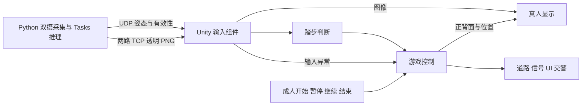

# TrafficLight 技术设计文档（轻量版 TDD）

状态：草稿，待用户审核。版本：0.3。日期：2026-10-09。

依据：[PRD](./PRD.md)、[GDD](./GDD.md)及[GLOSSARY](./GLOSSARY.md)。产品需求和游戏规则保持原确认结果；本文中的脚本划分、PNG 传输和动作算法是推荐实现，尚未实施。只修改技术文档，不进入代码开发。

## 1. 技术目标与范围

实现一条最小闭环：双摄像头 → MediaPipe 姿态与遮罩 → 原地踏步／停步／踏频 → 道路前进与信号规则 → 真人画面和交警反馈。

**已确认的技术约束**：Python 采集前后两台真实 RGB 摄像头，每路独立使用 MediaPipe Tasks Pose Landmarker；固定前路关键点控制动作，两路遮罩用于人物抠像。Unity 控制游戏并合成真人画面。儿童朝向屏幕原地踏步，不使用深度信息控制移动。

范围包括：有限直线路线、红绿黄信号、踏频控制走跑、错误进入和通行超时回位、实际停步后解除阻挡、正背面显示、必要成人操作及输入异常暂停。规则以 GDD 为准。

当前不实现实验数据采集／保存／导出、P01–P06 验收建议、三维人体重建、额外奖励或剧情系统。社交情绪模块保持现状，不抽取共用框架或共用目录。

## 2. 现有项目与技术选型

### 2.1 可复用基础

| 现有基础 | 用途与限制 |
| --- | --- |
| Unity 2022.3.62f3c1、URP 14.0.12、TextMeshPro 3.0.7 | 沿用场景、材质、文本和 Animator，不升级编辑器或增加视觉插件；版本依据 ProjectSettings/ProjectVersion.txt 与 Packages/manifest.json |
| Tools/PosePython：Python 3.12.10、MediaPipe 0.10.21、OpenCV 4.11.0.86 | 沿用现有环境和依赖；版本来自上一轮本机包元数据检查，双路运行仍待验证 |
| Tools/PosePython/body.py、preview_client.py | 参考采集、UDP 关键点和 TCP 最新预览发送；现有单摄 Legacy Pose 没有把遮罩发送给 Unity，不能直接满足本模块 |
| Assets/Scenes/SocialEmotion/Scripts/PoseCameraPreviewReceiver.cs | 复用后台收包、长度前缀和主线程 LoadImage 的实现方式；需增加双路、透明图像与有效性判断，不直接改原脚本 |
| 同目录 PipeServer.cs、PosePythonProcess.cs | 参考关键点接收与 Python 启停；不沿用骨骼 Transform 计步，也不挂载会自动建立旧预览的启动组件 |
| Tools/PosePython/LuminaPoseTracker.spec 与现有构建工具 | 沿用 PyInstaller 打包方式；新增 Tasks 的 .task 模型必须随运行时分发，不能假定旧 Legacy 资源已包含它 |

现有 body.py 未明确做 BGR→RGB 转换，且采集共享帧没有唯一序号；新入口应修正这些问题，不顺手修改社交模块。项目部分说明仍使用旧脚本路径，本文按实际 SocialEmotion 目录引用。

### 2.2 最小选型与必要性

| 组件／机制 | 实际问题 | 现有组件能否解决、是否有更简单方式 | 当前取舍 |
| --- | --- | --- | --- |
| 一个 Python 子进程，前后各一个 Tasks 实例 | Unity 需要双路人物和固定前路姿态 | 已有 Python 环境；Legacy 单摄不满足双路和多人异常检查。无需再引入 Unity 原生推理插件 | 用户已确认，当前必要；先验证模型及双路性能 |
| UDP 姿态＋双路 TCP 图像 | 动作输入不能被图像编码阻塞，两路都需保持可切换 | 项目已有 UDP/TCP；延续发送／接收方式即可，无需共享内存或消息中间件 | 当前采用；本机回环，不新增专门服务 |
| PNG 颜色与透明通道 | 将真人和遮罩完整、成对地送入 Unity | 现有 JPEG 无 alpha；同帧合成一个 PNG 比分开维护 RGB/mask 更简单 | 推荐首版，编码与解码成本待验证；若瓶颈明确，再换颜色＋遮罩同包传输 |
| 简单踏步判断代码 | 模型关键点不等于“踏步／停步” | 现有前倾移动和骨骼平滑不适用；一个普通 C# 辅助类即可 | 当前必要，无通用识别框架 |
| 一个游戏控制脚本＋人物显示组件 | 统一规则、位置、灯时及显示来源 | Inspector 引用、普通状态字段足够；无需事件总线、服务接口或多层管理器 | 当前必要，内部函数留给实施阶段 |

Tasks 支持姿态与可选遮罩；推荐先用 Full 模型、VIDEO 模式，CPU 推理，效果／性能不足再对比 Lite。这些是待验证配置，不是本机性能结论。[MediaPipe 官方说明](https://developers.google.com/edge/mediapipe/solutions/vision/pose_landmarker/python)

## 3. 整体实现方案

Unity 侧只分为四部分：输入组件、踏步判断、游戏控制、真人显示。游戏控制直接引用 UI、信号灯和交警，不再为这些表现各建管理器。

建议脚本名为 TrafficLightInput.cs、TrafficLightStepDetector.cs、TrafficLightGame.cs、TrafficLightHumanView.cs；这是职责边界，不预先规定内部类和函数。输入组件负责本模块 Python 进程及接收线程的启停，踏步判断可用普通 C# 类，其余使用 MonoBehaviour。

C# 脚本放 Assets/Scenes/TrafficLight/Scripts；场景、材质和配置放 TrafficLight 模块目录。Python 新入口放 Tools/PosePython/traffic_light_main.py；外部模型归 Assets/ThirdParty/MediaPipeModels。上述是未来实施位置，本轮不创建代码或资源。

运行顺序：准备检查双路 → 成人开始 → 每帧检查输入有效性、处理新姿态、更新规则和位置 → 更新人物／提示。成人结束与暂停在本帧推进前处理。动画或 UI 倒计时不能自行修改游戏规则。

## 4. 核心功能实现

### 4.1 双摄采集与推理

**输入**：前后设备索引、处理尺寸、模型路径。**输出**：带序号和采集时间的姿态、人物有效性及透明图像。

- Python 独占两台设备；Unity 不再打开同一摄像头。准备时检查前后索引不同，并由成人预览确认角色，重插后重新确认。
- 每路采集仅保存最新完整帧，生成递增 frameId；推理只处理新帧。保持图像比例，规范为竖直、非镜像的逻辑画面，BGR→RGB 后送入所属 Tasks 实例，不在两路间共用追踪状态。输出 x/y 沿用左上角原点、右／下为正的归一化坐标；33 点按 MediaPipe 原始索引排列，识别读取双肩 11/12、双髋 23/24、双膝 25/26、双踝 27/28。显示方向用实景左右标记验证，不额外翻转动作坐标。
- 推荐每路一个采集线程和一个处理线程；PNG 发送不阻塞姿态输出，沿用现有独立预览发送方式。线程数量服务于这两路输入，不引入通用调度器。
- VIDEO 模式使用递增毫秒时间；另保留真实读出时间供踏频计算，不从请求 FPS 推算动作间隔。读出时间不等于相机曝光时刻，驱动缓存延迟仍需测量。
- 设置 output_segmentation_masks=True、num_poses=2。无人、多人、必需点低置信或遮罩缺失输出无效状态；不能继续复用旧姿态。返回一人不保证画面中实际只有一人，漏检和跟踪切人需测试。
- Full .task 模型在开发配置时准备，发布随包携带；运行时缺失模型则提示失败，不自动联网下载。

### 4.2 真人抠像与显示

**输入**：同一推理帧的颜色和人物遮罩。**输出**：放在道路中的实时二维人物。

Python 将单人遮罩限制到 0–1，以可配置门限形成柔和 alpha；与原帧颜色合成带透明通道的 PNG。使用 OpenCV 编码时按 BGRA 排列，不画骨架，不把新颜色配旧遮罩。Unity 主线程用 LoadImage 更新 RGBA 纹理；PNG alpha 的生成和显示需用角标／透明背景测试。[OpenCV 图像编码](https://docs.opencv.org/4.11.0/d4/da8/group__imgcodecs.html)、[Unity LoadImage](https://docs.unity3d.com/2022.3/Documentation/ScriptReference/ImageConversion.LoadImage.html)

用一个世界空间面片和 URP 透明 Unlit 材质显示人物，关闭投射阴影，按深度遮挡关系摆放道路与不透明交警。它是二维抠像，不是三维人体重建。

准备时分别调整前后裁剪范围、人物显示尺寸和脚底锚点；固定显示尺度，避免每次抬脚都改变人物大小。游戏中只有虚拟路线位置改变，真实站位不控制移动。人物、交警和信号不能互相遮住关键提示。

前进用后路；实际停步、准备、暂停、结束和整个纠正流程用前路。纠正期间即使儿童仍踏步也显示正面；切换不改变路线进度，也不旋转或切换道路镜头。两路持续更新，避免切换时才启动目标摄像头。

### 4.3 踏步、停步与走跑

**输入**：新的前路二维关键点。**输出**：输入有效性、当前动作及踏频；与角色被阻挡、自动回位分开。

1. 准备时用稳定站立样本取得左右踝相对髋的基线，以肩中点到髋中点的二维距离归一化；检查双肩、双髋、双膝和双踝的置信度。脚部无法完整观察时先调整站位。
2. 观察左右踝相对髋的升降，结合膝部变化。每脚完成一次“抬起→落下”计一步；抬起／落下采用不同门限和短持续窗口，减少抖动重复计步。左右交替作为踏步依据，整体上下晃动不直接计步。
3. 首次动作可先处于“确认中”，不前进、不当作实际停步；确认交替踏步后进入踏步状态。门限和确认窗可配置，需覆盖慢速、低幅及不对称动作，不要求高抬腿。
4. 用最近相邻有效步间隔的中位数计算每分钟步数：$cadence=60/\mathrm{median}(\Delta t)$。每左／右脚一次完整动作计一步；样本不足先步行，不虚构高踏频。达到 GDD 跑动阈值才跑动。
5. 持续有效姿态中，脚部相对运动低且没有新起落，达到停步确认窗后判定实际停步。不能只靠“多久没收到步事件”判断，以免慢踏步误停。
6. 无人、多人、关键点不足或样本间隔过大输出“无效”，清除不完整动作与踏频历史；无效不等于停步。Unity 渲染帧不得重复处理同一个 frameId。

这些算法为推荐起点，尚未证明能可靠识别目标儿童动作。幅度、置信和时间窗口先由成人代测调整，再按后续安排验证儿童适用性。

### 4.4 道路位置、信号与纠正

**输入**：有效动作、踏频、成人命令。**输出**：路线位置、灯色、倒计时、人物来源及交警反馈。

用沿直线路线的距离表示唯一游戏位置；每个路口配置提示区起点、斑马线入口／出口及回位点。提示区与斑马线共同边界就是停止线，不建额外停止线对象。回位点必须在提示区内且入口前，不同路口区域不重叠。

用一个控制脚本保存当前游戏阶段、灯色、剩余时间、路口索引和本次反馈原因；状态沿用 GDD，无需通用状态机框架。灯色周期为红→绿→黄→红；尚未进入者黄灯显示等待下一次绿灯，不能使用催促进入的文案。走跑速度、路口时长、短距离误入上限、回位时长及识别参数通过 Inspector 配置，开始前检查，训练中不自动改变难度。

| 触发条件 | 必须实现的结果 |
| --- | --- |
| 首次进入当前提示区 | 激活该路口初始红灯；回位不会重新激活路口 |
| 有效踏步且允许移动 | 按踏频选择走／跑速度；实际停步原地停止，绿灯不自动带动人物 |
| 尚未进入时非绿灯越过入口 | 创建一次红灯／黄灯错误进入，限制近端短距离表现，交警阻挡后自动回位 |
| 绿灯越过入口 | 保存本次合法进入资格，灯色继续变化；黄灯显示倒计时，不重置灯时 |
| 反馈回位 | 儿童输入不驱动回位；到点后仍踏步则保持阻挡。回位完成且当前实际停步才解除，途中停过又踏步不算 |
| 纠正期间灯时 | 原红灯错误进入冻结剩余红灯时间；黄灯错误进入立即转红，超时在黄灯结束转红，两者设完整新红灯等待；反馈解除后恢复计时，不直接转绿 |
| 黄灯结束 | 只处罚合法进入且仍未到出口者；触发一次超时反馈并回当前回位点，不叠加错误进入 |
| 实际停步／成人暂停 | 停步只停止移动，灯时继续；成人或异常暂停冻结位置、灯时和反馈，保留通行资格与阻挡状态 |
| 到达终点／成人结束 | 停止规则推进，正面与结束提示；不要求先完成纠正，也不把游戏结束当作儿童主动停步 |

同一时刻按“结束→暂停／输入故障→已到出口的通行完成→灯相到期→新进入”处理。出口达到即完成；精确到期到达出口不回位。一次更新跨越灯时或道路边界时，分段计算移动与剩余时间，防止跑动跳过判定；异常长帧按技术故障暂停。进入判定与屏幕呈现的灯相保持一致。

倒计时和交警都读取控制脚本状态。交警停止手势的动画结束不解除阻挡；短语音按 GDD 可关闭、音量可调。成人恢复前确认输入正常且儿童实际停步，再继续保存的流程，不绕过纠正。

## 5. 关键接口与数据

仅保留下列跨边界数据，不预先建立服务接口、事件总线或完整类清单。

| 边界 | 必需数据／调用 |
| --- | --- |
| Python → Unity 姿态 | version、cameraRole、frameId、captureMs、width/height、status、personCount；前路另含 33 个点的 x/y/visibility/presence，后路只需人物有效性 |
| Python → Unity 图像 | cameraRole、frameId、captureMs、status 与同帧透明 PNG；前后各一条 TCP 流 |
| 输入 → 踏步判断 | 新前路姿态样本及其时间；不得使用平滑骨骼或关键点 z |
| 踏步判断 → 游戏 | 输入是否有效、动作=确认中／踏步／停步／无效、踏频及其有效标志 |
| 游戏 → 人物／表现 | 路线位置、前／后来源、灯色与剩余时间、游戏阶段、反馈原因；直接调用组件或更新引用 |
| 成人 → 游戏 | 开始、暂停、继续、结束；由游戏控制脚本处理 |

**通信建议**：只绑定 127.0.0.1，用本模块可配置端口，避开社交模块的 UDP 52733／TCP 52734。姿态使用 UTF-8 JSON 小包，单包表达一份完整结果；图像沿用 4 字节大端长度前缀，包体为“4 字节 JSON 元数据长度＋元数据＋PNG”。有效包 status=Valid；无效状态用简短原因，点数组或 PNG 为空，不补旧结果。限制包长和图像尺寸，验证版本、字段、有限坐标及长度后再分配或使用。

发送端图像槽和接收端待显示槽各只保存最新一帧；动作样本使用小型有界缓冲按序处理。重复／乱序序号丢弃，不刷新有效时间；动作缓冲溢出或样本间隔异常则暂停。元数据与图像作为整包替换，不拆开更新。

采集时间用 Python 单调时间，**只用于动作间隔和帧推进检查**，不能与 Unity 时钟直接相减。Unity 用本地接收时间检查断流，并比较采集时间与本地时间的推进是否出现新增积压；这不证明初始绝对延迟合格。TCP 内部仍可能排队，端到端延迟必须在 PoC 中测量；本稿不预设校时服务、ACK 协议或固定二进制字段表。

后台只收发字节，主线程处理 Unity 纹理、场景和规则；网络读写、Python 停止等待及模型推理不得阻塞 Unity Update。输入组件参考现有进程启动／stdin 停止方式，退出关闭 socket、释放设备与模型、销毁纹理；超时只终止自身启动的子进程。重启清空旧连接、包和识别历史，成人确认后恢复。

## 6. 异常处理与技术风险

**证据边界**：代码结构和版本已静态核查；本模块双摄、Tasks 模型、PNG 传输和踏步判定均未实测。没有已验证的识别准确率、延迟或最低硬件要求；研究资料及官网基准不构成项目实测结果。

| 问题 | 当前处理／风险控制 | 待验证内容 |
| --- | --- | --- |
| 摄像头或模型不可用、端口冲突 | 不允许开始；运行中暂停并向成人说明原因，不切另一摄像头代替控制 | 两设备同时打开、重插编号、模型资源与端口释放 |
| 任一路无人／多人／必需点或遮罩无效 | 暂停移动、灯时和反馈；不触发儿童违规，不用失效画面或动作继续训练 | 多人漏检、跟踪切人、背面和脚部识别；单人输出不是身份保证 |
| 晃动误计步、慢踏步误停 | 使用相对坐标、交替事件和持续停步判断；不能明确判断时输出无效 | 身高、低幅度、左右不对称及摄像机角度差异 |
| 抠像缺损或切换漂移 | 分别校准前后画面；过期／无效人物隐藏并提示问题，不能用旧画面冒充实时 | 双脚、背面、衣物边缘和一张白布能否满足两视场 |
| 双路推理／PNG 编码过慢、TCP 积压 | 调整处理尺寸／发送频率，优先 Lite 对照；保持最新槽并检查推进滞后 | 动作采样仍能观察抬落脚周期、端到端延迟、主线程峰值；PNG 瓶颈明确后才更换同帧图像格式 |
| 意外退出或无法释放设备 | 中止或暂停本次流程；重开进入准备；停止自有进程、连接与线程 | 重复启停、设备断开、Player 退出及稳定内存趋势 |

恢复必须由成人确认，保留原位置、剩余灯时、资格及阻挡，且当前实际停步。普通成人暂停期间输入继续更新；输入故障需要重建时先清历史，重新建立可靠停步结果。不能用系统位置不动证明儿童停步。

图像、姿态和调试状态仅在本机内存中使用，不保存儿童原始视频、关键点或身份，不上传云端。实验数据保存失败属于未来数据版本，本阶段没有保存模块，也不增加保存目录检查。模型分发时核对来源、版本和许可，不新增推理依赖或自动下载流程。

## 7. 开发顺序与技术验证

审核本稿后再安排实施；先验证输入闭环，再接游戏。验证中的数值依据实测调整，不将暂缓的 PRD P02 数值恢复为当前强制要求。

| 顺序 | 工作及前置条件 | 可观察、可复现的完成标准 |
| --- | --- | --- |
| 1. 双摄与模型 PoC | 使用实际电脑、两台设备和白布，成人代测；准备 Tasks 模型 | 两路正背面和双脚可观察；重复启动角色对应正确；遮罩与颜色同帧；无人、第二人进入、离场均有实际结果，不隐去失败 |
| 2. 透明显示与动作 PoC | 在步骤 1 基础上沿用 TCP/UDP 接 Unity | 角标确认方向、颜色及 alpha；前后人物尺度／脚底稳定；静止、晃动、慢／快踏步、变速和遮挡分别检查，缺失不当停步；测量实际延迟与采样间隔 |
| 3. 最小规则实现 | 输入路线经 PoC 认可后，先用人工动作输入检查规则 | 普通道路走跑停、仅绿灯进入、红黄灯单次纠正、当前停步解除、超时回位、到期已到出口、暂停保留状态、终点结束均符合 GDD 第 9 节 |
| 4. 单路口真实联调 | 将可靠输入接入步骤 3，加入真人、UI、交警 | 一条完整训练流程可重复；反馈不因动画结束提前解除，灯色／提示一致，切正背面不改变位置；再扩展配置路口数量 |
| 5. 退出与发布验证 | 联调完成，沿用现有 Windows/PyInstaller 构建方式，补齐 Tasks 模型 | 无开发 Python 的测试机可离线启动；关闭／重开、断开设备无残留本模块进程或占用；持续运行检查帧延迟、内存与纹理，报告实际配置和失败情况 |

PoC 先完成“输入是否可用、延迟是否可接受”的工程判断，再制定调试预算；若双路分割或二维踏步无法支持玩法，记录问题并复核技术方案，不偷偷改变 PRD/GDD。

规则边界用可控时间和人工动作序列测试；显示／设备问题在 Play Mode 与实际 Windows 包中检查。测试应覆盖功能风险，不为简单组件写只复述实现的测试。最终功能检查引用 PRD A01–A06、A15–A18 与 GDD 第 9 节，不据此宣称临床效果。

**审核重点**：四部分实现、沿用 UDP/TCP、透明 PNG 起点及先 PoC 后规则的顺序是否作为实施依据。技术数值留待验证调整；本稿交付后停在审核阶段，不自动修改代码、下载模型或执行摄像头测试。
