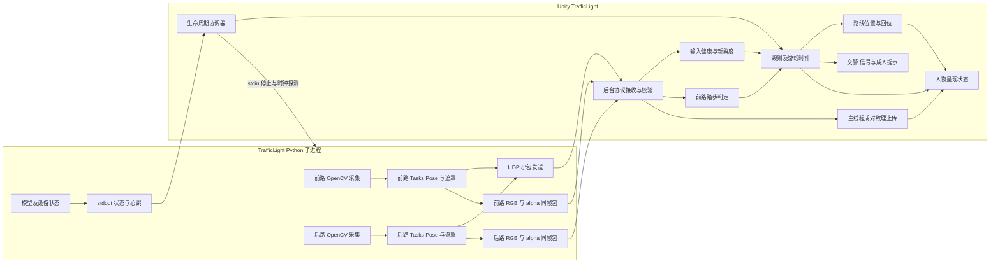
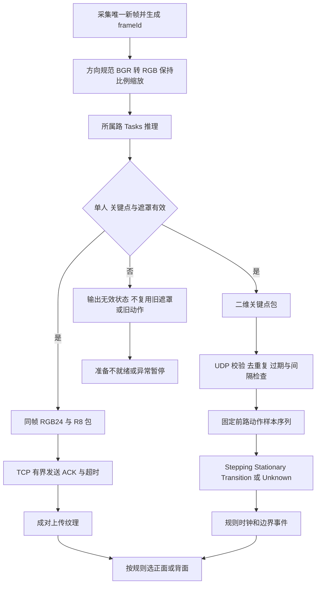

# TrafficLight 技术设计文档（TDD）

状态：完整技术方案，待用户审核；两项核心架构选择已确认。版本：0.2。日期：2026-10-09。

**结论与证据等级**：现有环境和官方能力支持实施这一路线，但尚无本模块实机 PoC。用户已确认“Python 双摄采集与推理，Unity 控制与合成”及“MediaPipe Tasks 双实例，固定前路控制踏步”。其余接口、传输、算法、调度及工程参数是本稿推荐设计，审核前不声称已批准或已实现。不得将文档级可行性等同实际准确率、延迟或帧率达标。

本次只编写文档，没有运行摄像头／模型、安装依赖、编写游戏代码或修改 PRD／GDD。审核通过后，先完成第 10 节验证门，再按第 11 节实施；PoC 失败须回到技术决策，不直接展开依赖它的游戏开发。

## 1. 文档信息与依据

依据优先级为 [PRD.md](./PRD.md) → [GDD.md](./GDD.md) → 技术设计。沿用 [GLOSSARY.md](./GLOSSARY.md) 中的错误进入、实际停步、合法通行、回位点等定义。[目标儿童研究](./ASD_USER_RESEARCH.md)及[干预游戏研究](./ASD_GAME_INTERVENTION_RESEARCH.md)仅提供参考。

- **已确认需求**：双真实前后摄像机、儿童实时二维画面融入道路、前进显示背面、停步及反馈显示正面；道路视角保持不变。原地踏步控制前进，以踏频区分走跑，不使用深度信息控制移动。
- **已确认规则**：以 GDD 的绿灯进入、红／黄灯错误进入纠正、黄灯限时通行、超时回位与实际停步后解除阻挡为准。数值参数仍可配置。
- **范围限制**：社交情绪模块保持稳定，不提前抽取共用目录。实验数据采集、保存、统计和导出仍暂缓；本方案不启用相关模块，保存失败的处置只适用于后续获批的数据版本。
- **事实口径**：文件、版本及源码行为已静态核查；“项目文档记载曾验证”不等于本次重复验证。模型效果、设备兼容、准确率、延迟与长期运行性能均未测得。

### 1.1 文档差异及解释

| 差异 | 处理依据 |
| --- | --- |
| AGENTS.md 与 PROJECT_CONTEXT.md 部分路径仍指向 Assets/Test 或 Assets/Scenes/Level2 | 实际姿态脚本位于 Assets/Scenes/SocialEmotion/Scripts；TDD 使用实际目录，本次不修改其他文档 |
| 研究资料建议 6–12 岁或讨论其他年龄 | 产品范围仍为学龄前与小学，不含初中；不将研究候选年龄替换 PRD |
| PRD P01–P06 含识别性能与数据保存建议 | 整体暂缓；90%／1 秒不是当前验收阈值，不用于证明技术已满足要求 |
| TDD 任务要求分析数据记录、导出、保存失败，而当前 PRD 暂缓这些功能 | 技术方案说明其范围和未来衔接，当前不设计数据库、记录接口或导出实现，不自行恢复数据开发 |
| 一张白布用于双向拍摄 | 两路均具有纯净背景并未验证；属于物理部署风险，不自动增加布料、减少摄像机或改用预录画面 |

## 2. 技术目标及范围

本模块需要建立可控的“采集帧 → 姿态／遮罩 → 踏步状态 → 规则结果／真人画面”链路，并把模型失败与儿童行为分开。

| 模块 | 本轮技术设计范围 | 排除或边界 |
| --- | --- | --- |
| 摄像头采集 | Python 独占前后 RGB 设备，持续双路采集、规范图像方向 | Unity 不再用 WebCamTexture 打开同一设备；不要求深度或硬件同步 |
| 姿态及分割 | 双路 Tasks Pose Landmarker，前路用于动作，两路用于人物遮罩及异常判断 | 不重建三维人体、不使用关键点 z 决定移动 |
| 动作判断 | Unity 使用新二维关键点估计实际踏步、实际停步及踏频 | 不从角色速度或镜头来源推断儿童动作 |
| 游戏及反馈 | 有限路线、红绿黄规则、同次回位／阻挡、交警提示、成人操作 | 不新增关卡机制、奖励或社交系统 |
| 人物合成 | 同帧 RGB／alpha 纹理与一个世界空间人物面片；正背面切换 | 不增加另一套虚拟前视镜头，不驱动 Avatar 骨骼 |
| 生命周期 | readiness、暂停／恢复、结束、设备／进程／模型失败与清理 | 不引入全项目常驻服务或自动切换摄像机控制源 |
| 实验记录／导出 | 标为暂缓；仅明确未来行为原因需要区分 | 无数据库、CSV、账号、记录接口、数据保存前置检查或日志指标模块 |

**文件与隔离原则**：Unity 新脚本、材质、配置和场景归入 Assets/Scenes/TrafficLight；C# 脚本放其 Scripts，其他资源直接放模块目录。Python 模块专用入口及辅助代码留在现有 Tools/PosePython 中，以 traffic_light_ 前缀区分；不新建共用目录。新增外部模型放 Assets/ThirdParty/MediaPipeModels。所有命名均为拟新增设计，不表示文件已存在。

不直接挂载 SocialEmotion 的 PosePythonProcess／PipeServer／PoseMovementInput。参考其进程、传输与打包经验，保留原 main.py、body.py 和场景行为；未来只对构建工具做必要、明确的新增运行时集成，不整理无关资源。

## 3. 运行环境与约束

| 项目 | 实际依据或值 | 限制 |
| --- | --- | --- |
| Unity | ProjectSettings/ProjectVersion.txt：2022.3.62f3c1 | 不为选型擅自升级编辑器 |
| 渲染 | URP 14.0.12；GraphicsSettings 指向 Assets/Settings/URP-HighFidelity.asset | 安装与配置事实，不是本次渲染测试 |
| 常用包 | Input System 1.14.2、Cinemachine 2.10.7、Animation Rigging 1.2.1、Timeline 1.7.7、TextMeshPro 3.0.7、Test Framework 1.1.33 | 来自 Packages/manifest.json；本轮未运行包解析 |
| Python | Tools/PosePython/.venv：3.12.10 | 只读包元数据核查 |
| Python 依赖 | mediapipe 0.10.21、opencv-contrib-python 4.11.0.86、numpy 1.26.4、pyinstaller 6.21.0 | 实际安装值与 requirements 文件一致；不自动追随上游版本 |
| 开发机 | Windows 11 64 位；Ryzen 7 H 255，8 核／16 线程；Radeon 780M；约 30.8 GiB 可报告物理内存 | 不是最低硬件要求；CPU／GPU 推理能力尚未测试 |
| 现有部署 | 源码具备 Windows 独立进程与 PyInstaller onedir 打包路径 | PROJECT_CONTEXT.md 记载曾验证单摄运行时；双摄及新增模型未验证 |
| 摄像机 | 当前源码默认 CAM_INDEX=0；实际前后设备型号、实际尺寸及帧率未核实 | 没有打开设备；USB 带宽和设备重连映射须实机确认 |
| 新增视觉插件 | manifest 未声明 MediaPipe Unity Plugin、Sentis 或 Barracuda | 不盲目增加依赖；Assets/ThirdParty 中资源包不等于视觉推理组件 |

项目内技术文件路径以 Lumina 根目录为基准。

### 3.1 现有代码与复用限制

| 文件 | 静态核查事实 | 对 TrafficLight 的影响 |
| --- | --- | --- |
| Tools/PosePython/body.py | OpenCV 单摄采集；Legacy Pose 开启 segmentation；只输出关键点及预览，不发送遮罩 | 分割能力已有入口，透明人物传输尚未实现；不能把 enable_segmentation=True 当作抠像功能已完成 |
| Tools/PosePython/global_vars.py | 默认 heavy 模型；处理上限 854×480、预览请求 12 FPS／JPEG 质量 70、水平镜像及骨架标记 | 这些是配置值，不是实际帧率；人物通道不能沿用带骨架的预览 |
| Tools/PosePython/preview_client.py | 独立 TCP JPEG 发送线程，应用侧仅保留最新帧 | 可参考有界缓存思路；TCP 本身仍可能积压，现有包无 frameId、摄像机标识、遮罩或采集时间 |
| Assets/Scenes/SocialEmotion/Scripts/PoseCameraPreviewReceiver.cs | 后台收字节，主线程 LoadImage 更新纹理；端口 52734 | 普通 JPEG 没有透明通道；直接复用不能满足前后人物与遮罩配对 |
| Assets/Scenes/SocialEmotion/Scripts/PipeServer.cs | 端口 52733，归一化点／visibility 与世界坐标；兼顾骨骼显示；按接收时间判断过期 | 可参考关键点解析，不能用平滑后的骨骼 Transform 计步；缺少完整帧标识及多人状态 |
| Assets/Scenes/SocialEmotion/Scripts/PoseMovementInput.cs | 已有移动使用身体偏移、前倾及 z 相关量 | 与 TrafficLight 的踏频／无深度输入不同，不直接复用其运动判定 |
| PosePythonProcess.cs 与 Assets/Editor/PoseRuntimeBuildPostprocessor.cs | 现有进程启动、stdin 停止与 Player 运行时复制 | 可参考生命周期与打包；启动器会自动建立原预览，不适合直接挂入新模块 |
| Tools/PosePython/LuminaPoseTracker.spec | 当前打包包含 full／heavy Legacy Pose 资源 | Tasks API 在已安装包中存在，但 .task 模型与独立打包尚未验证 |

**必须处理的源码缺口**：body.py 未显式将 OpenCV 图像 BGR 转 RGB 后再交给 Pose；官方示例要求该转换。当前 ret 与 frame 分开共享且无完整帧序号，推理可能重复读取同一采集帧。上述是代码检查发现，不是本轮测得的误判或性能结果；后续在 TrafficLight 独立入口解决，不顺手改动社交管线。[官方 Legacy Pose 示例](https://github.com/google-ai-edge/mediapipe/blob/v0.10.21/docs/solutions/pose.md)

## 4. 技术选型与决策

### 4.1 论证结论

| 技术问题 | 文档与代码层面的结论 | 尚未证明的部分 |
| --- | --- | --- |
| RGB 人体分割 | MediaPipe 提供人物遮罩；无需以深度摄像机作为模型输入 | 儿童全身、背面、双脚、衣物及动态边缘质量 |
| 双摄采集 | OpenCV／Unity 均有摄像机采集入口；要求每台设备只有一个采集所有者 | 当前两台设备并行打开、USB 带宽、断开后恢复及双路帧新鲜度 |
| 真人进入三维道路 | 二维颜色纹理加遮罩可在 URP 材质上透明呈现，角色进度由虚拟位置控制 | 前后尺寸、脚底锚点、遮挡排序和实际呈现延迟；不是真实三维人体重建 |
| 踏步／停步 | 可以从二维腿部关键点构建动作判定，频率映射由 Unity 完成 | 低幅度动作、身体晃动、快慢节奏、单脚遮挡下的误判；阈值不能凭空作为验收值 |
| 多人入镜 | 现有 Legacy Pose 只处理最显著人物，不能证明仅一人入镜；Tasks 的 num_poses 可配置 | 多人检测遗漏、跟踪切人及两路一致性；单个返回结果不保证画面只一人 |
| Windows 部署 | 现有项目已有独立 Python 运行时路径 | 双路分割、帧传输、模型资源及无开发环境电脑上的完整打包 |

上述说明存在可实施技术路径；整体系统是否满足实际训练环境仍由 PoC 决定。不得用厂商手机基准、他人 GPU 性能或旧单摄演示代替本项目测量。[Pose Landmarker](https://developers.google.com/edge/mediapipe/solutions/vision/pose_landmarker)、[URP 透明材质](https://docs.unity3d.com/Packages/com.unity.render-pipelines.universal@14.0/manual/lit-shader.html)

### 4.2 采集与推理归属比较（用户已选择第一条）

| 路线 | 功能与兼容 | 实时及成本权衡 | 当前判断 |
| --- | --- | --- | --- |
| Python 采集与推理；Unity 合成与游戏 | 延续 OpenCV、MediaPipe、独立进程和 Windows 打包 | 增加双路颜色／遮罩传输；需控制编码、内存复制和 TCP 滞后 | 推荐；TrafficLight 独立入口，避免改变 SocialEmotion 行为 |
| Unity WebCamTexture 采集；Python 推理 | Unity 直接拥有视频纹理；仍沿用 MediaPipe | 需要 GPU／CPU 图像读回和送帧，再返回遮罩；跨进程同步更复杂 | 合理备选；不能同时由原 Python 入口打开同一设备 |
| Unity 原生 MediaPipe 插件 | 在 Unity 内调用 MediaPipe；第三方插件声明支持 Unity ≥2022.3 | 增加原生库、插件兼容和崩溃风险；其 Windows 发布库为 CPU 推理，不提供默认 Windows GPU 加速 | 当前不优先引入 |

Unity 的请求分辨率、请求 FPS 及旋转／镜像 API 可以用于采集配置，但实际设备输出必须读取和测量。[WebCamTexture 2022.3](https://docs.unity3d.com/2022.3/Documentation/ScriptReference/WebCamTexture.html)；原生插件限制与 MIT／第三方许可说明见[作者仓库](https://github.com/homuler/MediaPipeUnityPlugin)。插件存在发布记录，不据此保证国内版编辑器或本机双摄兼容。

### 4.3 模型比较（用户已选择 Tasks 双实例）

| 候选 | 优势 | 限制与维护情况 | 建议用途 |
| --- | --- | --- | --- |
| 已安装 Legacy Pose 的遮罩 | 不新增推理依赖，已有 full／heavy 模型 | 单主体；Legacy 路线已被 Tasks 替代，不满足可靠多人异常判断 | 快速效果对照，不作为已满足全部要求的最终结论 |
| 同版本 MediaPipe Tasks Pose Landmarker | 关键点、可选遮罩及多姿态配置；本机 Tasks API 源码已存在 | 需要 .task 模型、独立入口和打包验证；两路模型实例有额外开销 | 优先 PoC，评估统一关键点与人物遮罩路线 |
| MediaPipe Image Segmenter／Selfie | 提供人物与背景分割 | Selfie 面向人像，不能据名称假定全身双脚／背面稳定；另加分割推理开销 | Pose 遮罩不满足效果时对照 |
| 白色背景阈值抠像 | 无新增模型、实现简单 | 白衣、反光及白布阴影易被误删；一张白布未必覆盖双向背景 | 不作为默认真人抠像路线 |
| Robust Video Matting | 视频时间信息与细化人物边缘的候选 | 引入新推理栈和模型；作者代码 GPL-3.0，需另行确认所用权重与分发条件；现有 AMD 核显性能未测 | 高成本后备路线，不直接纳入当前依赖 |

模型/API 依据：[Tasks Python](https://developers.google.com/edge/mediapipe/solutions/vision/pose_landmarker/python)、[Image Segmenter](https://developers.google.com/edge/mediapipe/solutions/vision/image_segmenter)、[Legacy／Tasks 状态](https://developers.google.com/edge/mediapipe/solutions/guide)、[RVM 作者仓库](https://github.com/PeterL1n/RobustVideoMatting)。MediaPipe 与 OpenCV 核心源码为 Apache-2.0；最终打包需核对具体模型、传递依赖和第三方声明，不以源码许可证代替全部资源许可。[MediaPipe 0.10.21 LICENSE](https://github.com/google-ai-edge/mediapipe/blob/v0.10.21/LICENSE)、[OpenCV 4.11.0 LICENSE](https://github.com/opencv/opencv/blob/4.11.0/LICENSE)

### 4.4 本稿确定的推荐基线

| 决策 | 结论 | 确认来源／验证条件 |
| --- | --- | --- |
| D01 进程归属 | 一个 TrafficLight Python 子进程拥有两路摄像机；Unity 拥有游戏与合成 | 用户已确认 |
| D02 推理接口 | 固定 mediapipe==0.10.21，前后各一个 Tasks Pose Landmarker；前路关键点驱动动作 | 用户已确认；双实例与模型文件兼容尚未运行验证 |
| D03 模型 | 先以官方 Full 的固定 v1 .task 包验证，Lite 为性能对照；不默认启用 Heavy | 推荐；锁定实际下载文件 SHA-256 与版本后打包，不运行时下载或自动升级 |
| D04 模式 | Python 各路专用线程使用 VIDEO 模式的 detect_for_video；独立实例、独立递增时间戳，输出遮罩 | 推荐；阻塞推理只在子进程线程中发生，不在 Unity 主线程；线程并行收益须测试 |
| D05 多人 | num_poses=2，返回人数标为 0、1、≥2；仅单人完整有效时使用结果 | 推荐；这是检测上限，不是可靠人数计数或身份跟踪保证 |
| D06 传输 | 小关键点包用回环 UDP；两路图像各自用 TCP，颜色 RGB24 与遮罩 R8 原始字节同包 | 推荐；先避免 JPEG 解码与损伤边缘，控制带宽／缓冲，性能由 PoC 决定 |
| D07 画面 | 双路持续采集和处理；显示只选一路，切换不重新开设备或改变姿态输入源 | 推荐，满足已确认切换规则 |
| D08 规则 | 一个 Unity 协调器推进显式状态与独立游戏时钟，按路径距离判断边界 | 推荐；避免协程／动画各自改变状态 |
| D09 故障 | 不可信输入为 Unknown，暂停规则与移动；成人确认恢复；结束优先 | 由 GDD 约束确定的技术落实 |

官方 Full 模型文件来源：[固定 v1 Pose Landmarker Full](https://storage.googleapis.com/mediapipe-models/pose_landmarker/pose_landmarker_full/float16/1/pose_landmarker_full.task)，不是本次已下载资源。API 源码已存在并不证明该模型在本机固定版本能加载，必须执行模型 PoC。

| 图像传输候选 | 代价 | 取舍 |
| --- | --- | --- |
| 原始 RGB24＋R8 | 每包 4WH 字节，需内存复制和 GPU 上传；无压缩推理画面损伤 | 首版基线，解析和配对简单；仅限本机回环 |
| JPEG＋R8 | 降低颜色带宽，但增加编码／解码与边缘颜色失真 | 实测原始传输成为瓶颈时复核；不能只传 JPEG 而丢失遮罩 |
| RGBA PNG | 携带透明通道，但压缩／解码开销需测试 | 低频对照，不作为默认实时链路 |
| 共享内存 | 可能降低传输复制，但增加同步、槽位所有权和清理复杂度 | 本模块没有测试证明需要，当前不引入 |

原始纹理上传依据 [LoadRawTextureData](https://docs.unity3d.com/2022.3/Documentation/ScriptReference/Texture2D.LoadRawTextureData.html)；压缩备选依据 [LoadImage](https://docs.unity3d.com/2022.3/Documentation/ScriptReference/ImageConversion.LoadImage.html)。格式契约与容量上限属于推荐工程设计，不是测得性能。

## 5. 系统总体架构



实验记录和导出不进入当前运行图。后台接收只处理字节、协议与线程安全缓冲，不操作 Unity 场景／纹理；所有游戏状态只由主线程协调器修改。



**运行顺序**：加载并校验配置 → Unity 绑定专用端口 → 启动 Python 与启动代号 → 打开两路设备、加载模型 → 等待两路新鲜的单人结果及成对画面 → 成人确认站位／准备 → 成人开始。模型结果到达后仅影响后续规则推进，不回溯改灯或撤销已呈现反馈；推理及起步／停步确认延迟须在 PoC 中测量。每个 Unity Update 依次接收结果快照、检查健康、处理新的动作样本、处理成人命令、推进规则／位置、产生单次反馈事件；LateUpdate 更新提示与人物面片。结束／暂停命令在推进前生效，不依赖全局 Time.timeScale。

## 6. 核心模块详细设计

### 6.1 摄像头与规范帧

Python 的前后 CaptureWorker 各独占一个 VideoCapture；设备索引、后端、请求宽高与 FPS 来自成人设置，禁止前后索引相同。先以 CAP_MSMF 测试，失败时允许在准备阶段明确改用 CAP_DSHOW，记录实际后端；不能运行中默默换设备。索引不是稳定硬件身份，重插／重启后必须重新预览确认前后角色，不承诺跨后端相同编号。设备采集和实际属性的依据见 [OpenCV 4.11 VideoCapture](https://docs.opencv.org/4.11.0/d8/dfe/classcv_1_1VideoCapture.html) 与 [后端／属性](https://docs.opencv.org/4.11.0/d4/d15/group__videoio__flags__base.html)。

每次成功 read 生成不可变 CapturedFrame，携带 CameraRole、WorkerEpoch、FrameId、CaptureUs、实际宽高及完整像素副本。CaptureUs 取 read 返回时的主机单调时间，表示帧被读出的时刻，不是相机曝光时刻；驱动缓存延迟须单独测量，不能仅凭该时间戳证明图像无设备滞后。共享槽只保留最新一个完整帧，以锁交换，不能分别读取 ret 和 frame。推理仅处理 FrameId 大于该路上次处理值的帧；输入未更新时不生成重复动作结果。失败状态不递增“成功采集序号”来伪造新鲜度。

规范处理：按设备设置旋转到竖直人体 → 撤销设备垂直翻转 → 统一非水平镜像的逻辑画面 → 保持原始比例缩小到处理上限 → BGR 转 RGB → 推理。图像逻辑坐标为左上角原点、x 向右、y 向下，姿态与遮罩使用同一处理帧。不会把普通相机的方向元数据假定为 WebCamTexture 属性；旋转／翻转通过配置与实景左右标记验证。成人若需要镜像诊断预览，可只镜像诊断显示，不更改动作坐标。

读取请求值、get 值与连续帧实测值分别呈现。任一路无帧、设备打开失败或必要身体部位不能入镜均不进入 Ready。资源由所属 worker 在 finally 中释放；设备重连采用 Unity 协调的整 Worker 重启：先释放两路，再由 Unity 生成并传入新 WorkerEpoch、清空缓存并重新建立两路；停止训练推进，保留规则暂停快照，等待成人确认。Worker 不自行生成代号，否则新包会被 Unity 拒绝。设备驱动 read 阻塞无法仅靠线程取消时，生命周期管理可终止本模块子进程后重启，不能保留占用旧设备的线程。

### 6.2 Tasks Pose 与单人有效性

每路一个 PoseLandmarker，固定 VIDEO 模式、output_segmentation_masks=True、num_poses=2；不共享实例或将前后交替送入一个追踪实例。采用输入 CaptureUs 转递增毫秒时间戳；同毫秒的新帧时间戳加一，保留真实 CaptureUs 用于频率计算。不用人工增加的毫秒差计算踏频。同步 API 在 Python 推理线程执行。API 支持及时间戳要求见 [Tasks Python](https://developers.google.com/edge/mediapipe/solutions/vision/pose_landmarker/python)。

- 无姿态／模型失败：明确输出状态，Unity 不沿用最近有效姿态继续走。
- ≥2 姿态：该路视为多人异常，不选最大人物继续控制；两路任一异常均暂停。
- 恰好一姿态：校验必需点位置有限、visibility／presence 及身体构型；不是“全部画面只有一人”的证明。多人漏检与跟踪切人须专项测试，成人保持单人拍摄条件。
- 没有生物识别或儿童身份识别。人体位置、尺度突然变化视为可能切人／离场，不自动重新选人；异常后清空动作历史，由成人确认原参与者再恢复。
- 必需点：双肩 11／12、双髋 23／24、双膝 25／26、双踝 27／28；足跟 29／30、脚尖 31／32用于脚部范围检查。前路点不足使动作 Unknown；后路姿态或遮罩无效使人物输入不就绪。

保持固定前路作为动作源，即使背面画面正在显示，亦不使用后路关键点替代；否则左右、姿态幅度与时间窗口会跳变。后路关键点只用于完整性、人物锚点校验和异常。不会使用 world_landmarks 或 z 作为踏步、走跑或路线进度依据。

### 6.3 人体遮罩与真人合成

单人有效时，选其对应遮罩，保持与同次推理的 RGB 帧、尺寸、CameraRole、Epoch、FrameId 一致；禁止新颜色配旧遮罩。float 遮罩限制到 0–1 后转换到 R8。首版使用可配置上下界 smoothstep 作 alpha，不直接把置信概率称为精确透明度／发丝 matting。可选小范围边缘滤波须检查运动拖尾；首版不跨帧平均遮罩来“平滑”快速抬脚。

Python 输出 RGB24 与 R8 的连续、**自底向上行序**字节，以适配 Unity 原始纹理存储；逻辑关键点仍为左上角坐标。两种纹理统一 wrap=Clamp、filter=Bilinear、无 mipmap；颜色按颜色纹理读取，遮罩设为 linear=true。准备阶段用 [SystemInfo.SupportsTextureFormat](https://docs.unity3d.com/2022.3/Documentation/ScriptReference/SystemInfo.SupportsTextureFormat.html) 检查 RGB24 与 R8；不支持时可在 Unity 内将已校验字节扩展为 RGBA32 后上传，保持协议与同帧配对不变，并测量额外复制成本，禁止静默显示错误格式。上传采用稳定的双缓冲纹理对：先写入不可见槽，两个 Apply 都完成才切换引用，避免当前帧混合。协议方向通过四色角标及脚底标记测试，不能再进行未记录的二次镜像。

真人使用一个世界空间、面向固定虚拟相机的人物面片，脚底落在唯一的 RouteAnchor。准备时成人确认两路全身裁剪框与静止脚底锚点；按相同虚拟身高归一化，固定尺度与裁剪框，不逐帧追随抬脚改变面片大小。裁剪框须包含完整可参与动作范围，姿态越出范围即提示调整，不能通过缩放隐藏离场。前后切换沿用各自校准框，使虚拟脚底与路线位置保持一致。

URP Unlit 材质基线：颜色乘遮罩 alpha，Blend SrcAlpha OneMinusSrcAlpha，ZTest LEqual，ZWrite Off，关闭投射阴影；角色是二维面片，没有真实人体体积、三维自遮挡、真实光照／身体阴影。交警与道路采用不透明对象，让深度测试表达前后关系，避免复杂透明物体重叠；信号提示使用屏幕 UI，不被真人遮住。透明表现依据 [URP 14 材质](https://docs.unity3d.com/Packages/com.unity.render-pipelines.universal@14.0/manual/lit-shader.html)。

在保持道路构图／朝向一致的虚拟相机中，仅替换面片纹理来源；相机可随 RouteAnchor 沿直线路线平移，不为显示正面旋转或切换镜头。首版直接切到已准备的有效纹理对，不跨相距较远的旧帧交叉淡化产生双人轮廓。ForwardMovement 使用 Rear；实际停步、纠正、回位、等待停步、准备／暂停／结束使用 Front。若在回位时儿童还踏步，仍显示 Front；不能用后路人物动画确认实际停步。

### 6.4 踏步、停步及踏频判定

推荐 Unity 内一个纯数据 StepRecognizer；输入只处理新的前路 PoseSample，更新以 CaptureUs 的样本时间为准，不按渲染帧重复计步。处理结果有 Quality 与 Motion 两个维度；Unknown 永不等价于 Stationary。

1. **尺度与基线**：先把归一化 x／y 按实际宽高换算成像素比例一致的二维平面。以肩中点到髋中点距离作为尺度 S；S 太小或必需点低置信时无效。准备时用稳定站立样本建立每条腿的踝相对髋纵向距离基线，并由成人简短踏步示范检查。该准备属于输入配置，不新增教学关卡或快速踏步能力要求。
2. **抬脚特征**：每侧计算 $r=(y_{\mathrm{ankle}}-y_{\mathrm{hip}})/S$，$lift=r_0-r$（$r_0$ 为站立基线）；以膝相对髋的升降作为佐证。身体整体上下平移通过相对坐标抵消；双腿同时相似变化、上身侧摇而脚部无独立变化，不作为左右交替踏步。基线在训练期间不追随动作自动漂移，只能准备／暂停时重新确认。
3. **脚部事件**：每侧设 Grounded→Lifted→Grounded 的状态，以 liftHigh／liftLow 滞回和最小有效持续时间抗抖；一次完整抬脚落脚产生一次 StepCompleted，不因同脚持续抬起重复计数。对不对称动作使用独立左右幅度配置，但计步语义相同。
4. **起步**：首次可信抬脚进入 Transition；观察到不同脚的有效连续事件并满足可配置交替时间窗后进入 Stepping。Transition 时不前进、不产生实际停步事件；无需孩子额外按钮。起步确认时间需和低幅／慢踏步一起测，不把尚未确认的动作当识别丢失。
5. **踏频**：只在有效步事件间隔计算，每左或右完整步计一步。使用最近若干相邻有效步的间隔中位数：使用 $cadence=60/\mathrm{median}(\Delta t)$，其中 $\Delta t$ 为相邻有效步间隔（秒）。没有足够间隔时输出 CadenceValid=false，Stepping 可先步行；不凭空填高踏频进入跑动。两条腿相邻事件的间隔不能被算作一个双步周期。
6. **停步**：在持续有效关键点中，无新的脚部起落、脚部相对运动低于 stationaryMotionGate 且持续 stationaryWindow 后进入 Stationary。任一侧仍可信抬动就不能凭“另一侧不动”判停；慢踏步的正常间隔不能仅因 noStepTimeout 短而误判为停步。站立样本满足条件时，无需此前必须踏步才可输出 Stationary。
7. **失效**：前路过期、低置信、无法辨别交替、多人、尺度跳变或采样大间隔时输出 Unknown，清空不完整脚部周期与踏频窗口，暂停游戏；不能在失效时间内累计 stationaryWindow。丢包少量间隔可继续，但超过配置的最大样本间隔不能猜出中间步数。

时间／置信与幅度门限统一放 StepRecognitionConfig，以实际慢／快、晃动与遮挡 PoC 调整。本稿不指定未经验证的最小儿童抬腿高度。GDD 的走跑阈值保持一个阈值：在滤波后的有效 cadence ≥ runCadence 时 Run，否则 Walk；不擅自新增不同的游戏进入／退出跑动阈值。滤波影响的延迟必须测量。

### 6.5 游戏规则、边界与时序

规则控制不使用人物图像中脚的位置推动世界；唯一虚拟路径距离 s 决定 RouteAnchor。每个 Junction 配置 PromptStart、EntryBoundary、ExitBoundary、ReturnPoint；EntryBoundary 正是提示区和斑马线共同边界，不创建额外停止线物体。校验 PromptStart ≤ ReturnPoint < EntryBoundary < ExitBoundary，不同路口区域顺序不重叠，终点在最后出口之后。

内部拆为三个小状态字段，不构建多层通用状态机框架：FlowState 对应 GDD 的准备／普通道路／路口判断／合法通行／纠正／等待停步／已结束；LightPhase 为 Red／Green／Yellow；PauseSnapshot 保存暂停前状态、位置、剩余灯时与反馈进度。PauseReason 可为 Adult 或 InputFault。

| 触发 | 技术动作及不变量 |
| --- | --- |
| 首次到达 PromptStart | 激活当前 Junction，LightPhase=Red 并初始化剩余时间；反馈回位不会重新触发首次进入 |
| 允许前进 | Quality 有效且 Motion=Stepping；速度按有效踏频选择 walkSpeed／runSpeed，始终只沿路线正向；Stationary／Transition 不推动位置 |
| 非绿灯下新越界 | 当前 s≤EntryBoundary 且候选位置>EntryBoundary 时，创建一次 RedEntry／YellowEntry；以当前可见灯色判断，限制近端短距离表现，进入反馈，禁止继续穿行 |
| 绿灯新越界 | 锁定本次合法进入资格，但不锁绿灯；当前灯时继续推进，后续进入 Yellow 倒计时 |
| 非法进入与超时反馈 | 原 RedEntry 冻结剩余红灯时间；YellowEntry 立即转红并设置完整 redDuration；Timeout 在黄灯结束转红时设置完整 redDuration；所有反馈期间冻结计时 |
| 回位 | 沿虚拟路线从越线点／区内点返回当前 ReturnPoint，耗时由 GDD 配置；儿童输入不驱动回位。重复踏步不创建第二次反馈 |
| 解除阻挡 | 回位完成且当前 Quality 有效、Motion=Stationary；确认当前停步，不接受只在途中曾停过。交警退出，恢复红灯计时，不直接转绿 |
| 合法通行到期 | 仅对已绿灯进入的 Crossing 尝试判定；s≥ExitBoundary 已完成，不超时；否则发一次 Timeout，不再算红／黄灯新进入 |
| 真实停步 | 只停止输入前进，不冻结灯时／倒计时；合法进入者可再起步，仍受原剩余时间限制 |
| 成人／异常暂停 | 不推进位置、灯时或回位；保存资格与阻挡；识别仍运行以判断恢复健康，不能借暂停绕过反馈 |
| 恢复 | 成人确认、所有必要输入恢复且当前 Stationary；恢复位置与剩余时间／反馈阶段，不提前消除阻挡；保留已确认的当前停步状态，重置脚部周期与踏频历史，后续起步重新确认 |
| 结束 | 先中止状态推进及反馈，停止路线，显示正面与结束提示；无需实际停步才让成人结束，亦不声称儿童已主动停步 |

**同帧顺序**：成人结束最优先，其次暂停／健康故障；其余由一个 Tick 计算灯相边界、道路边界及反馈。把 dt 分成不跨灯相／路径边界的片段；在同一时刻，先判到达 ExitBoundary 的通行完成，再处理灯相到期，再处理尚未进入者越线。灯相切换后才展示对应提示并允许该相位的进入，不在同一帧把红灯图示与绿灯准入混用。若一帧跨过多个路口边界，必须顺序消费剩余 dt，不能瞬移跳过规则；异常长帧超过模拟间隔保护值直接技术暂停，不静默补走。

游戏时钟由规则协调器持有，只在运行／输入健康且非纠正时推进；不使用墙钟、Python 推理时间或 UI 倒计时作为规则时钟。UI 显示规则快照的剩余黄灯时间（向上取整且不显示负数）；到期仅控制器产生一次结果，UI 不回调判定。误入的短距离表现上限小于通行区长度，跑速不扩大该上限。

### 6.6 反馈、成人 UI 与生命周期

交警控制器消费 FeedbackReason、事件代号与人物位置；错误进入在共同边界附近出现，超时在当前人物前方出现；先停止手势、自动回位，等待实际停步后退出。动画结束不能解除阻挡，位置／灯色由规则层独占；动画只负责表现，避免 NPC 与人物遮住信号。实现可用 Animator，无需新增 Timeline 演出。

成人 UI 提供设备与输入状态、简短开始／暂停／继续／结束，保持必要控制；诊断页显示实际尺寸、帧龄、有效性、脚部事件／踏频，仅在内存中调试。儿童提示沿用 GDD 文案，不引入技术参数交互。

生命周期：Stopped→Starting→AwaitingInputs→Ready→Running／Paused→GameEnded→Stopping→Stopped；成人退出可从任意状态进入 Stopping。自然到终点或成人结束训练进入 GameEnded，保留双路采集与正面呈现；重新开始回 AwaitingInputs 检查输入及准备条件，退出模块才释放设备。若需结束后释放设备，应先明确显示非实时结束页，不用旧画面冒充实时；首版采用保留采集。场景退出则关闭所有接收器及本模块子进程。

Worker 使用独立 stdin 命令与 stdout NDJSON 状态；stderr 输出有界、不含图像／儿童身份的诊断。控制通道统一 UTF-8 NDJSON，每行一个对象；Unity 命令包含 version=1、type=Stop 或 ClockPing、workerEpoch（128 位代号，编码为 32 个十六进制字符），ClockPing 另含 requestId。Worker 状态包含 version、workerEpoch、type=Starting/Ready/CameraFault/ModelFault/Heartbeat/Stopped/ClockPong；设备状态带 cameraRole，故障带固定 errorCode 和短 message，ClockPong 回 requestId 与 pythonMonotonicUs。读取器限制单行长度（建议 16 KiB），校验版本与代号，诊断不得混入 stdout；心跳间隔与超时配置化。心跳证明进程活着，不证明摄像机或姿态新鲜。启动前 Unity 绑定端口，端口被占用立即提示，不任意结束其他进程。退出发 Stop，设终止标记并关闭 socket、释放 capture 与模型；在有界等待后仅终止本模块拥有的进程。Unity 纹理销毁放主线程，receiver 关闭连接以唤醒阻塞读取，线程退出后清空所有帧缓存。

## 7. 数据结构与接口

以下是推荐契约，不是已经写入项目的 C# 类型；不依赖 SocialEmotion 的 Body／Avatar 数据对象。

### 7.1 模块契约

| 拟新增模块／文件 | 输入 → 输出；接口 | 更新频率／依赖 | 错误处置 |
| --- | --- | --- | --- |
| TrafficLightSessionController.cs | 成人命令＋配置＋健康 → SessionState；Begin/Pause/Resume/End | 主线程每帧协调一次；持有各模块引用 | 统一暂停原因和进程清理 |
| traffic_light_main.py／camera.py／inference.py | CameraConfig → PosePacket／FramePacket／WorkerStatus | 每路只推理新的采集帧；固定包与模型 | 显式 CameraFault／ModelFault，不造旧帧 |
| TrafficLightVisionReceiver.cs | UDP／两路 TCP → immutable PoseSample、FramePacket；TryDequeuePose/TryTakeLatestFrame/GetHealth | 后台收包，主线程读取；回环绑定 | 校验大小、代号、序号、格式与缓冲上限 |
| TrafficLightStepRecognizer.cs | 前路 PoseSample＋StepRecognitionConfig → MotionSnapshot／StepCompleted；Consume/Reset | 每个新前路样本一次，不按渲染帧重复 | Unknown 与恢复清历史 |
| TrafficLightRuleController.cs | MotionSnapshot＋InputHealth＋成人命令 → RuleSnapshot／一次性 RuleEvent；Tick/Restore | 主线程 Tick；只读游戏配置 | 同帧优先级、反馈单次锁存、长帧暂停 |
| TrafficLightRouteMotor.cs | 控制器的 s → RouteAnchor；ApplyPosition | 每个有效规则 Tick，仅改变虚拟位置 | 不自建规则或以视频位移改进度 |
| TrafficLightHumanPresenter.cs | 成对纹理＋RuleSnapshot＋RouteAnchor → 世界空间面片；CommitFrame/SetView | 新画面时上传，每帧显示稳定锚点 | 不显示不匹配遮罩；切换源过期时暂停 |
| TrafficLightFeedbackPresenter.cs | RuleEvent／Snapshot → 交警、信号、简短提示 | 事件触发动作、快照更新倒计时 | 不以动画回调决定纠正结束 |
| TrafficLightConfig.cs | Inspector／ScriptableObject 配置 → 各模块不可变配置 | 开始前检查；训练中不自动升难 | 参数不合法留在准备，并指出字段 |

C# 文件均计划位于 Assets/Scenes/TrafficLight/Scripts。Python 辅助文件实际实施时用 traffic_light_camera.py／traffic_light_inference.py 等前缀；上表短名只表示职责，不创建新公共包。

### 7.2 运行时数据

| 数据 | 字段与语义 |
| --- | --- |
| CameraConfig | Role、DeviceIndex、Backend、RequestedWidth/Height/Fps、Rotation、FlipY、ProcessMaxWidth/Height；不能从设备索引推断前后角色 |
| PoseSample | WorkerEpoch、Role、FrameId、CaptureUs、InferenceDoneUs、Width/Height、DetectedCount、Flags、Landmarks[33]；每点 x/y/visibility/presence；不含深度控制量 |
| FramePacket | 同样的帧标识与状态、RGB24Bytes、AlphaR8Bytes；两者尺寸完全相同、自底向上行序，颜色为 RGB |
| InputHealth | Front/Rear 采集、推理、人物、遮罩与呈现的新鲜度，FaultReason；单个 Ready 不能代替分项检查 |
| MotionSnapshot | Quality、Motion=Stationary/Transition/Stepping/Unknown、CadenceValid、StepsPerMinute、LastSourceFrameId；不包含角色是否被阻挡 |
| JunctionConfig | PromptStart、EntryBoundary、ExitBoundary、ReturnPoint、Red/Green/YellowDuration、MaxIncursion、ReturnDuration |
| RuleSnapshot | FlowState、LightPhase、RemainingLightSeconds、RouteDistance、JunctionIndex、HasLegalEntry、FeedbackReason、FeedbackId、ReturnProgress、PauseReason、ViewRole |
| RuleEvent | 单调 EventId、类型、路口索引、原因、位置；用于同次表现去重，仅内存事件，无实验保存接口 |
| PauseSnapshot | 原规则状态、灯相剩余、路线位置、资格、FeedbackId 与回位进度；不得丢失纠正要求 |

示例契约仅说明调用边界，不构成完整实现：

```csharp
// 拟议数据契约；实现时可用具体类型，不必创建通用服务层。
public enum MotionKind { Stationary, Transition, Stepping, Unknown }
public enum FeedbackReason { None, RedEntry, YellowEntry, Timeout }
public interface ITrafficLightPoseSource
{
    bool TryDequeueFrontPose(out PoseSample sample);
    InputHealth GetHealth();
}
// StepRecognizer.Consume(sample) -> MotionSnapshot
// RuleController.Tick(gameDeltaSeconds, motion, health, adultCommand) -> RuleSnapshot
// HumanPresenter.CommitFrame(role, matchingRgbAlphaPair)
```

### 7.3 通信协议 v1

新模块专用、绑定 127.0.0.1：推荐 UDP 52743，Front TCP 52744，Rear TCP 52745；不使用 SocialEmotion 的 52733／52734。端口属于开始前配置，不是已探测空闲事实。进程启动由 Unity 传入 WorkerEpoch（随机 16 字节启动代号），所有包必须匹配；重启即更换代号，清空旧包与动作历史。它是临时协议代号，不是实验儿童编号或持久化训练标识。

TCP 每帧外层为 uint32 大端长度（不含本长度字段），接着下列 72 字节头及负载；UDP 直接使用该头＋点负载。整数大端，float 为 IEEE-754 binary32 大端；明确用字节读取，不按 C# 结构体内存布局直接 marshal。

| 头字段 | 类型／字节 | 语义 |
| --- | --- | --- |
| Magic | 4 字节 ASCII TLV1 | 格式识别 |
| Version / MessageKind / CameraRole | uint16 / uint8 / uint8，共 4 | Version=1；Kind 1=Pose、2=Frame；Role 0=Front、1=Rear |
| WorkerEpoch | 16 字节 | 启动代号 |
| FrameId / CaptureUs / InferenceDoneUs | 三个 uint64，共 24 | 该路序号、Python 单调采集时间及推理完成时间 |
| Width / Height | 两个 uint16，共 4 | 规范处理帧实际尺寸 |
| DetectedCount / Flags / Reserved | uint8 / uint8 / uint16，共 4 | Count=0/1/2（2 表示≥2）；Flags 的 bit0 采集有效、bit1 推理有效、bit2 遮罩有效、bit3 方向已规范；其余位及 Reserved=0 |
| PointCount / Reserved | 两个 uint16，共 4 | 单人 Pose=33；无效 Pose 或 Frame=0 |
| ColorBytes / AlphaBytes / PayloadBytes | 三个 uint32，共 12 | 点包前两项为 0；图像包分别 3WH、WH；严格校验长度总和 |

Pose 单人有效负载为 33×4 float（x、y、visibility、presence），528 字节，加头为 600 字节；无效／多人包不输出可用点（PointCount=0）。检测数不得被当作实际总人数。UDP 建议限制≤1200 字节；丢包不重传，不用累计旧包追赶儿童动作。

Frame 负载按 RGB24 后 R8，完整原始像素与遮罩同包。有效 Frame 要求 PointCount=0、Count=1、Flags 的 bit0–3 均置位，ColorBytes=3WH、AlphaBytes=WH、PayloadBytes=4WH。无效／多人 Frame 是例外状态包：Width=Height=PointCount=ColorBytes=AlphaBytes=PayloadBytes=0，保留实际 Count 与故障 Flags，外层长度=72；不分配纹理或把旧遮罩补回。有效 Pose 要求 PointCount=33、Count=1、bit0/1/3 置位、ColorBytes=AlphaBytes=0、PayloadBytes=528；无效 Pose 的点负载与字节字段均为 0。缺帧故障可带最后成功序号，但应先处理故障状态再执行有效帧去重；这种包不能刷新有效时间。无效 Frame 也须主线程确认状态并 ACK，避免发送端阻塞。限制 payload≤8 MiB、实际尺寸≤配置上限，并在分配前用 checked 算术验证 WH、字节数与外层长度。只有单人及遮罩有效才提交纹理；错误／未知版本断开该连接并报告，不继续解析污染字节。

**有界与背压**：每路 Python 采集槽／待发送图像槽容量 1；TCP 每路仅允许 1 包在途。Unity 收到完整包并在主线程提交或判过期丢弃后，将确认提交给该路后台发送槽，由后台线程回同连接发送 8 字节大端 FrameId ACK；主线程不做 socket 写入或等待 ACK。等待 ACK 超时即关闭重连，不堆积旧帧；图像发布线程阻塞不会阻塞采集、推理与 UDP。Unity 图像缓冲同样只保留该路一个完整包。

姿态入口保留小型有界新样本序列（推荐每路 32 项），Unity 顺序消费前路新样本，避免渲染慢时丢掉整个抬落脚周期；队列溢出或采集时间间隔超过门限即 Unknown／暂停并清历史，不能在恢复后补算历史步数。重复／乱序 FrameId 丢弃，不刷新有效时间。后路只用于健康；仍校验其包及时性。

### 7.4 时钟与新鲜度

Python time.monotonic_ns 与 Unity Stopwatch 各自起点不同，不能直接相减。启动与恢复时用 stdin Ping／stdout Pong 做最小往返校时：Unity 记发出 t0 与收到 t1，Pong 携带当前 Python 单调时间 p，估计偏移为 (t0+t1)/2−p；误差界为 RTT/2，使用多次探测中最小 RTT 项。一次探测、重启与训练中周期探测只为工程时钟，非实验日志。

读出后的帧龄用映射后的 CaptureUs 加误差界判断，不包括设备曝光到 read 返回的未知延迟；同时检查 Unity 单调接收时间、FrameId 是否推进、采样间隔及每路图像／姿态龄。校时失效／误差过大不能靠“刚收到”认定缓存画面新鲜，应不就绪或暂停。首次图像显示要求同路 RGB／alpha 精确同帧；前后不同物理相机无硬同步，只要求各自年龄与两路最新采集时间差在工程门限内，切换时选新鲜目标源，不能宣称前后拍摄时刻完全相同。

## 8. 性能与稳定性

### 8.1 指标与调试起点

无本模块实测性能，也没有当前已批准的 FPS／准确率／延迟最终阈值。下面仅为 PoC 的可调整工程起点；不覆盖 GDD 参数，不引用暂缓的 P02 为当前要求。

| 项目 | 推荐试验配置或观察量 | 判定用途 |
| --- | --- | --- |
| 采集／推理 | 首轮请求 640×480／30 FPS，推理及发送上限每路 15 FPS；实际值分别测量 | 是试验点，不保证请求实现；足部／人物细节不足时比较其他比例与分辨率 |
| 帧与姿态年龄 | 调试初值上限 0.5 秒，允许样本间隔初值 0.25 秒；校时 RTT 上限初值 0.1 秒 | 保护门限，必须依据实测低速动作及异常调整；不是用户反应要求 |
| 稳态内存 | 缓冲／纹理／线程数量和运行中内存趋势 | 有界，无持续增长；不预设最大 RAM 最低硬件 |
| Unity 主线程 | 协议消费、动作判断、纹理上传、GC、帧时间分布 | 不在主线程推理／socket 读写；发现峰值要定位而非笼统称 AI 优化 |
| 长时间运行 | 成人代测，建议至少 30 分钟，重复启停 20 次并注入断连 | 工程试验规模，非 PRD 正式验收阈值 |

采集／推理上限改变必须仍能观察有效抬落脚周期。图像可以比动作更新慢，但不允许通过放宽过期门限，让不能可靠看清的旧人物继续移动。参数和模型 Full/Lite 每次训练前固定，运行中不自动变模型或升降识别规则。

### 8.2 资源预算与处理

原始图像带宽为两路 4WHF 字节/秒：640×480、每路 15 FPS 约 36.9 MB/s；854×480、每路 15 FPS 约 49.2 MB/s。这是算术预算，不是测得吞吐，尚未包括头、ACK、网络栈复制、模型临时内存与纹理上传。

各路 RGB＋mask 纹理对双缓冲、稳定重用；每包只复制必要的不可变像素，不用无限 ConcurrentQueue。旧图像槽替换后释放 byte[]／归还池；改变尺寸时在准备／暂停中重建纹理，旧纹理主线程 Destroy。后台不能调用 Texture2D.Apply、Transform、Time 或直接触发场景动画。网络长度、模型输出、native buffer 有明确所有者，Tasks 返回对象有效期内复制需要的数组，不能把下次推理覆写的视图交给传输线程。

GPU 仅负责 URP 合成；Python 首版按 CPU 能力验证，不将 AMD 核显当作 CUDA 或已启用 GPU delegate。两个模型线程可能争用 CPU／native 线程池，Python 线程也不保证线性加速；PoC 比较调度、处理上限、Full/Lite。捕获槽持续更新，推理线程跳过过时待处理帧；UDP 动作不等待 TCP 的 ACK。

延迟分解：曝光／设备缓存 → 采集读出 → 缩放／转换 → 推理 → 筛选／发送 → 回环接收 → 主线程上传 → 渲染，以及动作确认窗口。分别统计 p50／p95 与异常最大值，校时误差明确记录；不能只把推理耗时当端到端延迟。优化顺序为消除排队和重复帧、降低无效复制、合适模型／分辨率、缩短经过验证的动作窗口；只有测量证明需要才改压缩、共享内存或推理栈。

## 9. 异常处理与隐私保护

| 异常 | 处理 | 恢复／结果边界 |
| --- | --- | --- |
| 任一路打开失败／断开／read 无有效新帧 | 准备时不就绪，运行时暂停位置／灯时／反馈，显示摄像机角色及原因 | 释放后重建，清缓存和动作历史；成人确认，不能自动改用另一摄像机 |
| 模型／.task 加载失败或文件不匹配 | 留在准备，报告模型与错误；模型缺失不联网自动下载 | 由开发／成人修复配置后重启；不伪造姿态或切 3D Avatar |
| 必需点／遮罩不足，人体离场 | Unknown，暂停；旧画面过期后隐藏人物并显示成人提示 | 恢复稳定输入且实际停步，由成人继续；不记孩子主动停步或违规 |
| 多人或疑似跟踪切人 | 暂停，要求只保留原参与者；不选择最大人物 | 无身份自动辨认保证，成人确认；重新建立有效输入 |
| 置信波动／过大采样间隔 | 不反复发停步事件；Unknown 并暂停，保留规则快照 | 调参或调整摄像机；不能用人物系统静止替代实际 Stationary |
| 图像损坏／遮罩不匹配／协议超限 | 丢整包、断开异常流，清当前待提交对，不复用旧 mask | 对应流重新就绪；必要输入失败暂停规则 |
| UDP／TCP 过期、ACK／校时失败 | 暂停；心跳仍在也不能解除 | 流恢复＋成人确认＋实际停步；反馈锁存仍有效 |
| 进程意外退出／Unity 意外中断 | 运行时暂停或终止本次游戏；重开进入准备 | 当前无持久化游戏／实验恢复要求；已丢内存状态不称可恢复 |
| 配置无效／端口冲突 | 阻止开始，指出配置／端口；不抢占或杀别的进程 | 成人或开发修正后重新开始 |
| 训练数据保存失败 | **当前不适用**：没有数据保存模块，不能用保存目录检查阻止当前游戏 | 后续恢复数据需求时另行设计并审核暂停、缺失范围与恢复策略 |

不保存原始视频、音频、姿态关键点或儿童身份。本方案的 RGB／mask／点仅在本机内存与 127.0.0.1 传输；场景退出清除所有缓冲，不创建图像临时文件、不上传云推理。即使没有落盘，真人画面仍是儿童个人信息，成人应能清楚看到摄像机正在运行，程序不能暗中保留或导出帧。

工程诊断默认内存面板与受控文本，不记录完整关键点／图像、姓名或身份；外部提供测试素材、保存调试视频／截图或开展儿童测试均须独立安排，不由本次文档任务自动执行。后续实验匿名编号由独立数据方案确定，不以当前 WorkerEpoch 代替。

## 10. 技术风险与 PoC 验证

先完成文档／API 的可行性论证，再选择当前基线；随后使用实机 PoC 决定基线是否能投入实施。本稿没有执行 PoC，因此没有任何风险标为已经消除。

| 风险 | 原因及影响 | 措施与验证 | 备选路线／变更边界 |
| --- | --- | --- | --- |
| 双路全身抠像不稳 | Pose 遮罩不是细致 matting，背面／白衣／双脚及快速动作可能缺损，影响真人显示 | 两路分别检查身体／脚部、边缘、遮罩配对及人物裁剪；比较 Full/Lite | 在同一 Python 边界中比较 Image Segmenter；新推理栈需重新核对性能／许可 |
| 晃动被当踏步 | 仅用踝绝对纵坐标易受整体移动影响 | 相对髋和身高归一化、左右事件与膝佐证；成人晃动／原地踏步对照 | 若二维特征失败，不偷偷使用深度；回到输入方案审核 |
| 儿童身高与幅度差异 | 足部像素过少、动作不对称、慢步间隔影响置信与停步 | 按尺度与每腿基线调试，成人先验证，再按另行安排进行适用性测试 | 调整视场与可配置阈值，不统一要求高抬腿或快跑 |
| 摄像机／白布布局 | 前路纯净背景不能自动保证后路也纯净；设备可能互相入镜或遮住人 | POC-1 画出实际站位与两视场；检查屏幕／布料不遮挡运动 | 背景依赖降低或协商布置；增设备／布料须明确需求变更 |
| 多人漏检与切人 | num_poses=2 不是安全完整计数；后路可能跟踪成人 | 插入／离开人物、遮挡、尺度变化测试；成人现场确认 | 增加专用人检测只有在证明必要后复核；不能声称有身份跟踪 |
| 双模型实时性能不足 | CPU 推理、纹理上传、USB 和本机传输共享资源 | 逐阶段测量，检查有界缓冲、Full/Lite 及双路热机表现 | 降采样需仍保留有效动作周期；必要时复核原生插件／推理栈，而非直接放宽输入过期 |
| Unity／Tasks 兼容及分发 | 已存在 Tasks API 不等于模型／PyInstaller 全资源正常；原生插件未安装 | 固定依赖与 .task 哈希，离线干净电脑打包测试 | 首选解决模型与包资源；变更依赖锁定版本需单独审查 |
| 帧配对／时间不同步 | 独立线程、TCP 排队或不同单调起点可能显示旧人及误计步 | frameId、代号、同帧 RGB/mask、ACK、校时与注入乱序／延迟 | 性能证据支持后可改共享内存；不能通过伪造时间戳消除延迟 |
| 规则同帧歧义 | 同时变灯、越线与超时会重复处罚 | 可控时钟边界单元测试、一次性反馈代号、到出口优先 | 规则不变，调整明确的调度与分段计算 |

以下为后续审核后的验证任务，不是已经完成的实验，也不要求现在保存儿童原始视频。

| 顺序 | 验证问题 | 最小实验与完成依据 | 失败时处理 |
| --- | --- | --- | --- |
| POC-1 | 实际双摄是否可采集且站位可行 | 先由成人代测，固定前后设备角色，检查两路全身／脚部、白布遮挡和重启后映射；记录实际模式、帧新鲜度、设备释放及重连结果 | 调整视场、USB 连接或协商部署条件；不得默认减少摄像机 |
| POC-2 | 同帧颜色与全身遮罩是否可用 | 对比 Pose 与候选分割，检查正背面、踏步、衣物、双脚、多人进入；校验画面与遮罩 frameId 一致，缺失遮罩不沿用旧遮罩 | 调整采集与模型；不把二维分割称作三维重建 |
| POC-3 | 低幅踏步及实际停步能否区分晃动与丢失 | 新帧驱动二维特征；覆盖静止、摇摆、原地交替踏步、变速、遮挡与离场；人工对照动作事件，输出有效／无效而非把丢失当停步 | 调整归一化、置信门限和时间窗口；模型失效暂停游戏，不记儿童错误 |
| POC-4 | Unity 合成与双路推理是否达到可用性能 | 在实际 URP 场景分别测采集、推理、编码、传输、主线程上传、渲染和动作响应；使用受控成人素材或人工输入，不要求儿童录像 | 降采样与有界缓冲；如需换推理栈，提交路线复核 |
| POC-5 | 打包与生命周期是否完整 | 干净 Windows 环境离线启动，反复开始／结束及断开设备；检查子进程、端口、线程与纹理释放；持续运行时比较内存趋势 | 修正资源打包或清理流程，未通过不开展依赖此能力的游戏联调 |

当前没有最终性能阈值；PoC 报告应保留实际配置、测量方法、延迟分布与失败情况，再形成工程调试预算。不得将 PRD 暂缓建议恢复为当前强制验收。

## 11. 开发任务拆分与实施顺序

下表是后续开发依赖计划，不是本轮实施承诺；实施与资源创建须在 TDD 审核及用户安排后进行。

| 任务 | 前置 | 主要实施与预期产物 | 技术完成判据 |
| --- | --- | --- | --- |
| T01 双摄部署 PoC | TDD 路线审核 | 两路设备配置与视场／白布记录、采集诊断 | POC-1 可复现，前后角色正确，实际模式及释放／重连有结果 |
| T02 双路模型与遮罩 PoC | T01 | .task 来源／SHA、Tasks 双实例、单人及多人结果报告 | POC-2，BGR/RGB、全身正背面与遮罩同帧验证；失败则停止此基线 |
| T03 图像／姿态传输 PoC | T02 | 协议 v1、UDP 小包、双 TCP＋ACK、成对纹理和角标测试 | 乱序／重启／畸形包／慢接收不会污染状态或积压；CPU/GPU 预算可观察 |
| T04 踏步判定 PoC | T02 | 独立识别器、可配置幅度与时间窗、成人动作对照结果 | POC-3：真实动作、晃动、失效可区分；无深度、无重复帧计步，记录失败不夸大准确率 |
| T05 性能及集成门 | T03、T04 | 同步图像＋动作＋URP 空场景，延迟与稳定性报告 | POC-4；审核实际目标预算、可参与动作范围与未解决缺陷后才接游戏 |
| T06 规则纯数据实现 | T05 | 配置／规则状态／路径边界、可控时钟测试 | 覆盖第 6.5 节及 GDD 第 9 节，包括到期到出口、短距离误入、回位途中停步、暂停恢复 |
| T07 场景与人物／交警表现 | T06 | 最小道路路口、RouteAnchor、面片材质、UI／NPC、前后校准 | 相同规则快照唯一控制位置／灯／反馈，正背面仅换人物，提示不遮挡 |
| T08 生命周期及 Windows 分发 | T07 | 专用 Worker 启停、模型检查、独立打包与工程故障提示 | POC-5；完整目录无开发 Python 也能离线启动，无残留本模块进程／设备占用 |
| T09 技术交付检查 | T08 | 功能情景报告、配置版本、依赖清单及缺陷范围 | 与 PRD A01–A06、A15–A18／GDD 第 9 节逐条对应；不声称完成 P01–P06 或临床验证 |

### 11.1 打包落地

拟新增 Tools/PosePython/traffic_light_main.py、对应辅助模块、TrafficLightTracker.spec 与 build-traffic-light-runtime.cmd；编辑器使用现有 .venv，Worker 接收命令行前后索引、端口、模型路径与 WorkerEpoch。新运行时名称建议 LuminaTrafficLightTracker.exe，输出 Tools/PosePython/dist/LuminaTrafficLightTracker。

Player 路径为 PoseRuntime/TrafficLight/LuminaTrafficLightTracker.exe，带齐 PyInstaller onedir 内库和 Models/pose_landmarker_full.task。沿用现有 Windows 构建工具并添加新运行时检查／复制，不替换原 LuminaPoseTracker。构建集成需检查现有预处理器对 Legacy runtime 的无条件要求，完整四模块包保留所需两个运行时；不能只拷贝新的 EXE 或在用户机器临时 pip install。模型与新依赖属于未来实施产物，本次不创建。

PyInstaller 打包许可应保留相关声明并核对所用版本与依赖，不能将构建工具许可替代应用全部素材／模型许可。[PyInstaller 许可说明](https://pyinstaller.org/en/stable/license.html)

### 11.2 技术验证与验收衔接

- EditMode：以人工构造 PoseSample 序列验证计步去重、停步／Unknown 边界、尺度归一化、频率单位；以可控 dt 验证灯时、进入资格、回位点、反馈单次、暂停快照与优先级。不写只镜像实现而不验证规则的测试。
- PlayMode：以受控帧替身验证 RGB／alpha 同步、角标方向、人物面片／交警／提示遮挡及生命周期；替身通过不意味着真实模型识别通过。
- 设备 PoC：核查真实双摄与 CPU 推理、失效／多人、快慢动作、长时运行与 Windows 包。明确记录环境、模型版本和实际观测；工程试验统计不等于实现实验数据采集模块。
- 最终验收：功能条件引用 PRD 与 GDD；若需要最低 FPS、准确率、延迟或真实儿童样本指标，由 PoC 后独立验收方案确定，不拿官网基准或暂缓 P02 数值自动签收。

## 12. 待确认事项

| 类型 | 项目 | 当前结论与决策时点 |
| --- | --- | --- |
| 已确认架构 | Python 统一双摄与推理，Unity 动作／规则／合成；Tasks 双实例、固定前路控制 | 用户于 2026-10-09 逐项选择；不再重复追问 |
| 待审核技术设计 | Full v1 起点、VIDEO 模式、num_poses=2、协议 v1、原始纹理＋ACK、二维计步、时钟／调度、异常与打包 | 本稿推荐方案，用户审核 TDD 后作为实施基线，不称已实现 |
| 待设备核实 | 前后摄像机型号、接口、视角／安装距离、可用分辨率／帧率、白布与屏幕实际布局 | T01 核查；不能按开发机配置推导目标机最低要求 |
| 待 PoC | 双路全身／背面抠像、多人检测范围、输入误判、延迟、长时稳定与干净机运行 | T01–T05/T08 的验证门；任何失败应记录并复核方案，不自动变更产品 |
| 待数值调整 | 识别门限／时间窗／健康保护预算；GDD 的路口时长、跑动踏频及速度 | 配置化、PoC／后续试用调整，不要求现在逐项选数字 |
| 暂缓范围 | 实验数据采集、保存、统计、导出及 P01–P06 | 保持 PRD 决定，本轮 TDD 讨论不恢复 |

当前没有额外要求用户立即提供全部硬件参数或批准测试执行。两项关键架构选择已完成；审核对象是这份完整技术方案。后续代码、场景、模型下载与 PoC 执行等待用户安排。

## 13. 技术参考资料

查阅日期：2026-10-09。项目资料与固定版本源码用于事实核查；当前官方 API 能力用于技术论证，不等于已安装版本／具体模型已运行通过。各来源已在相应结论旁链接。

| 来源 | 用途 |
| --- | --- |
| [PRD](./PRD.md)、[GDD](./GDD.md)、[GLOSSARY](./GLOSSARY.md) | 已批准功能、规则与领域定义 |
| [目标儿童研究](./ASD_USER_RESEARCH.md)、[干预游戏研究](./ASD_GAME_INTERVENTION_RESEARCH.md) | 动作差异、个体适用性与证据边界；不作为额外需求 |
| [MediaPipe Pose 指南](https://developers.google.com/edge/mediapipe/solutions/vision/pose_landmarker)、[Python API](https://developers.google.com/edge/mediapipe/solutions/vision/pose_landmarker/python) | 候选 Tasks、模型、关键点、遮罩、时间戳与运行模式 |
| [BlazePose GHUM 模型卡](https://storage.googleapis.com/mediapipe-assets/Model%20Card%20BlazePose%20GHUM%203D.pdf) | 模型设计与使用限制核查；不得当作本项目儿童性能报告 |
| [Image Segmenter](https://developers.google.com/edge/mediapipe/solutions/vision/image_segmenter)、[Legacy 状态](https://developers.google.com/edge/mediapipe/solutions/guide) | 分割备选与接口维护状态 |
| [OpenCV 4.11.0](https://docs.opencv.org/4.11.0/d8/dfe/classcv_1_1VideoCapture.html) | 设备与实际采集属性、后端和资源释放 |
| [Unity 2022.3 WebCamTexture](https://docs.unity3d.com/2022.3/Documentation/ScriptReference/WebCamTexture.html)、[原始纹理 API](https://docs.unity3d.com/2022.3/Documentation/ScriptReference/Texture2D.LoadRawTextureData.html)、[URP 14](https://docs.unity3d.com/Packages/com.unity.render-pipelines.universal@14.0/manual/lit-shader.html) | 采集备选、纹理上传和透明合成依据 |
| [homuler 作者仓库](https://github.com/homuler/MediaPipeUnityPlugin)、[RVM 作者仓库](https://github.com/PeterL1n/RobustVideoMatting) | 第三方备选的功能、平台与许可边界 |

本稿核查了实际 AGENTS.md、PROJECT_CONTEXT.md、两份研究资料、已批准文档、Packages/manifest.json 与相关 ProjectSettings、Tools/PosePython、Assets/Scenes/SocialEmotion/Scripts 和 Assets/Editor 的管线／构建代码。Assets/Scenes/TrafficLight/Scripts 本次读取时没有游戏功能脚本；本稿拟新增类型并非已存在代码。
